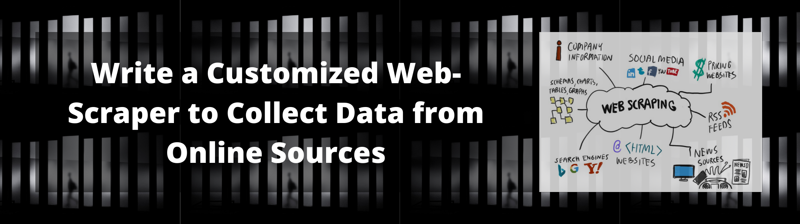
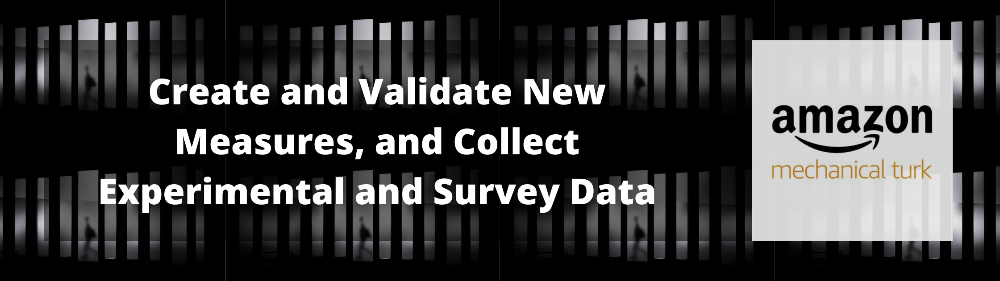

## Create a New and Relevant Dataset

We live in am exciting moment. The data necessary to address the relevant and meaningful questions related to your business and personal goals is more available than ever before. However, it can still be difficult to collect and organize that data in a manner in which it can be utilized. As such, I would love to help you build a new dataset tailored specifically to address your questions. The following are some examples of data collection projects I would be happy to help you with.

### Utilize an API

Many organizations have created APIs to share particular data that they have collected with the public. However, collecting that data can be difficult for those without prior experience. As such, I provide a service in which I help you to gain access to API credentials, write a program to collect data relevant to your project, conduct some initial processing and cleaning, and then export the new data set into your preferred file format. In addition, I will provide thorough anotation within the program so that you can understand how the program works, and know how you can use this program again in the future. There are numerous valuable and useful APIs, but I will give you two examples to give an idea of what is possible.

{width=100%}

**Twitter**

+ Utilize Twitter's API to obtain a tremendous amount of interesting and valuable data related to differing users, or products or topics.
+ The documentation for these APIs can be found at https://developer.twitter.com/en/docs.

{width=100%}

**YouTube**

+ Utilize Google's API to obtain data from Youtube. You can obtain data related to specified channels, videos, and topics.
+ The documentation for these APIs can be found at https://developers.google.com/youtube/v3.

## Write a Web-Scraper

There is also an incredible amount of data that is available online, but there is no API to help collect it. In these cases, I can write a web-scraper that iterates through all relevant webpages and collects the desired information. The possible available sources and projects are numerous, but I will give two examples of prior projects, which I hope to be instructive regarding what is possible.

{width=100%}

+ The federally funded Small Business Innovation Research (SBIR) and Small Business Technology Transfer (STTR) programs are designed to stimulate technological innovations by providing financial support to U.S. businesses that are conducting research, and developing new technologies. To better understand these programs, and the types of projects that tend to receive funding, I first wrote a web-scraper to create a list of all available awards on the SBIR website (i.e., sbir.gov). I then wrote a scraper that iterated through the list of award page links and collect the relevant data for more than 85,000 web-pages. I also cleaned and prepared the new data set, and I converted the data to an appropriate format. I was then able to conduct a number of analytic and machine learning tasks that helped me to extract meaningful insights regarding the types of projects that tend to receive funding. 

+ I was interested in an organization that made available the speeches of all of their semi-annual conferences from the past 40 years. I again wrote a web-scraper that collected the links for every speech that is available on the organizations web-page. I then wrote a scraper that iterated through the list of links, and collected the text from every speech. I was then able to store the data in a new database, and was able to extract numerous insights regarding the organization through the use of textual analysis and nlp techniques.

## Surveys and Experiments

Lastly, it is possible that you would like to obtain survey/experimental data related to your specific questions. I have more than five years of experience in conducting online experimental and survey research studies. In addition, I have a strong psychometric background, and have experience utilizing classical test theory and item response theory to construct and validate new measures. I would be happy to help you design new measures, as well as help you to use those new measures to collect data from current and potential customers/users. 

{width=100%}

## Please Reach Out

No matter the project, If you are needing help collecting data of any kind, I would love to discuss the project with you. If you are interested, please click on the contact page and send me a message. I look forward to hearing from you.
